# Conway's Game of Life - Architecture Documentation

## Overview

This is a GPU-accelerated implementation of Conway's Game of Life using WebGPU, written in Odin. The application runs on both desktop (SDL3) and web (WebAssembly) platforms with a unified codebase.

> **Note:** This is based on the SDL3 trinagle example and a port of the tutorial you can find here: https://codelabs.developers.google.com/your-first-webgpu-app#0. The original tutorial used JavaScript.

**Key Features:**
- 32×32 cell grid (1,024 cells)
- 5 Hz simulation update rate (200ms intervals)
- Compute shader implementation of Game of Life rules
- Ping-pong buffer architecture for efficient GPU updates
- Simple, direct architecture following Odin idioms

**Learning Goals:**
- Using Odin to implement something previously done in JavaScript
- Working with Odin WGPU bindings: https://pkg.odin-lang.org/vendor/wgpu/
- Platform abstraction using Odin's build tags

---
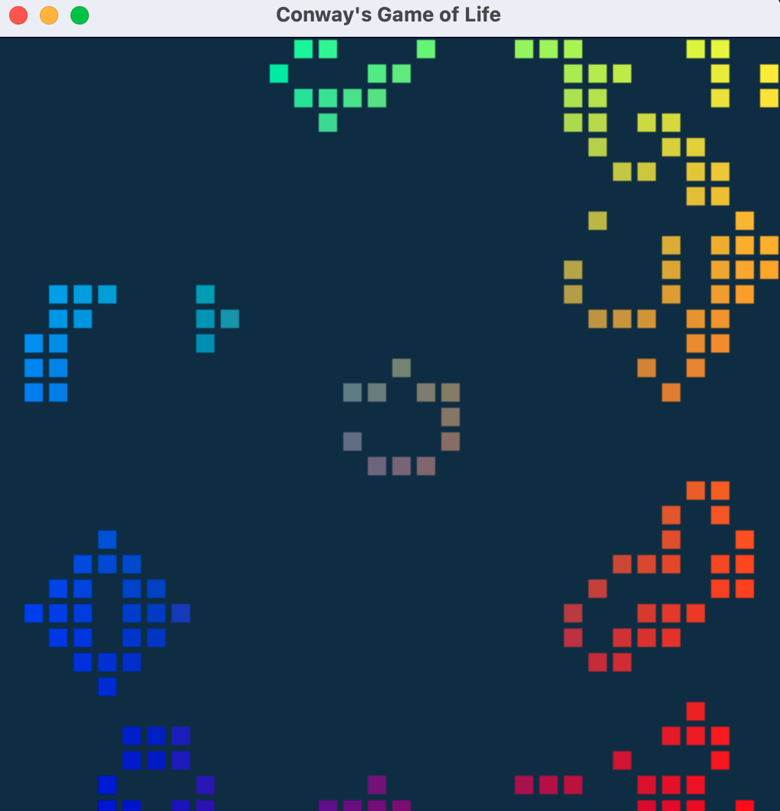

---

## Project Structure

The codebase follows a simple 3-file structure:

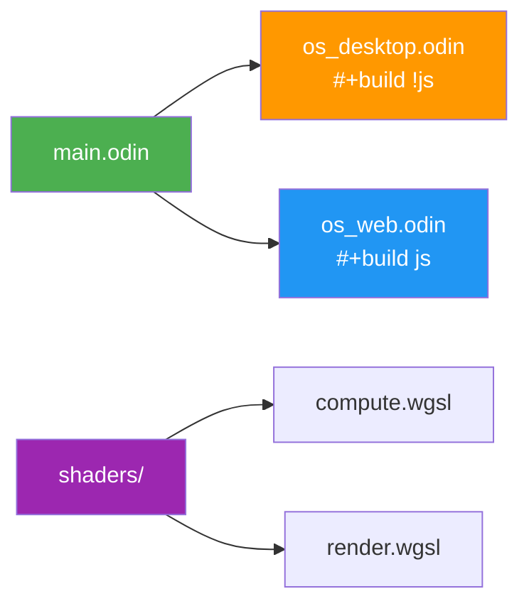

### File Overview

| File | LOC | Purpose |
|------|-----|---------|
| `main.odin` | 466 | Core GPU logic, state management, rendering |
| `os_desktop.odin` | 104 | SDL3 platform layer (synchronous) |
| `os_web.odin` | 122 | WASM platform layer (asynchronous) |
| **Total** | **692** | **Complete application** |

### Build Tags

Odin's build tag system selects the appropriate platform file at compile time:

- **Desktop build:** `odin build .` → Uses `os_desktop.odin` (excludes `os_web.odin`)
- **Web build:** `odin build . -target:js_wasm32` → Uses `os_web.odin` (excludes `os_desktop.odin`)

---

## Architecture Overview

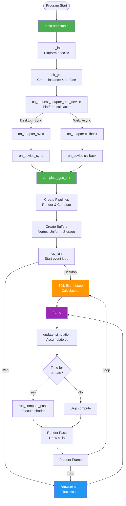

---

## main.odin - Core Application Logic

The main file contains all GPU-related code and the application state.

### Key Components

#### 1. Configuration Constants
```odin
WIDTH :: 512                            // Window width
HEIGHT :: 512                           // Window height
GRID_SIZE :: 32                         // 32×32 grid
WORKGROUP_SIZE :: 8                     // Compute shader workgroup size
UPDATE_INTERVAL_MILLISECONDS :: 200.0   // 5 Hz update rate
```

#### 2. Application State
```odin
App_State :: struct {
    ctx: runtime.Context
    
    // WebGPU core
    instance, surface, adapter, device: wgpu.*
    queue: wgpu.Queue
    config: wgpu.SurfaceConfiguration
    
    // Pipelines & layouts
    pipeline_layout, bind_group_layout: wgpu.*
    render_module, compute_module: wgpu.ShaderModule
    render_pipeline: wgpu.RenderPipeline
    compute_pipeline: wgpu.ComputePipeline
    
    // Buffers
    vertex_buffer, uniform_buffer: wgpu.Buffer
    cell_state_storage: [2]wgpu.Buffer  // Ping-pong
    bind_groups: [2]wgpu.BindGroup
    
    // Simulation
    step_index: u64
    did_compute, do_update: bool
    last_tick: time.Tick
    accumulator: time.Duration
}
```

#### 3. Initialization Flow

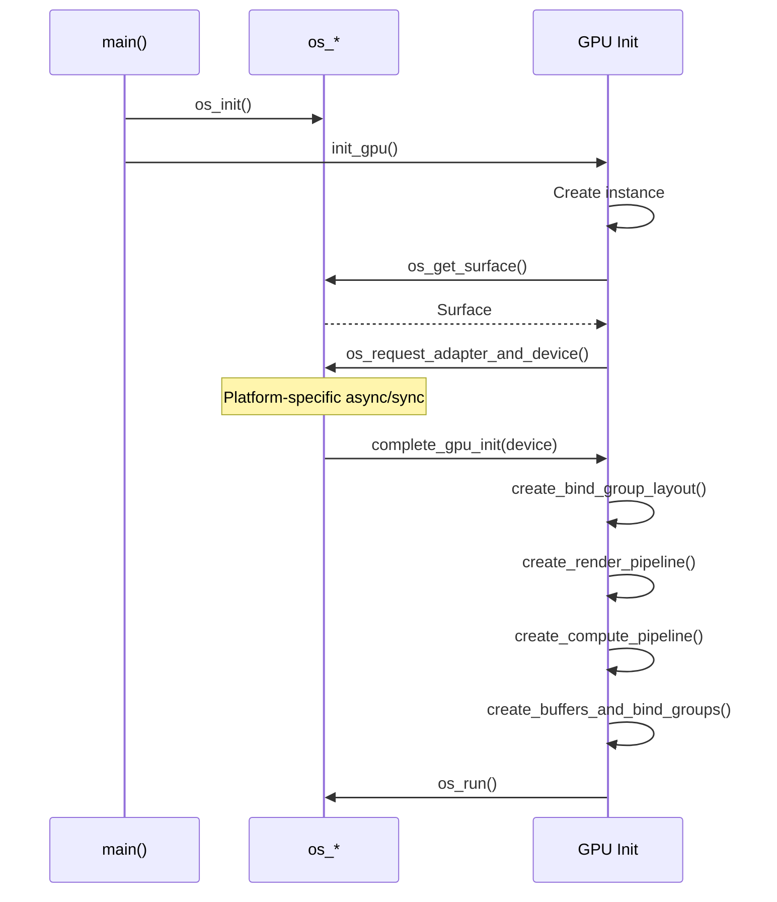

#### 4. Pipeline Creation

**Render Pipeline:**
- Vertex shader positions cell instances in grid
- Fragment shader colors cells (green/black)
- Reads from storage buffer to determine cell state

**Compute Pipeline:**
- Implements Conway's Game of Life rules
- Reads from one storage buffer (current state)
- Writes to another storage buffer (next state)
- Runs at 5 Hz (every 200ms)

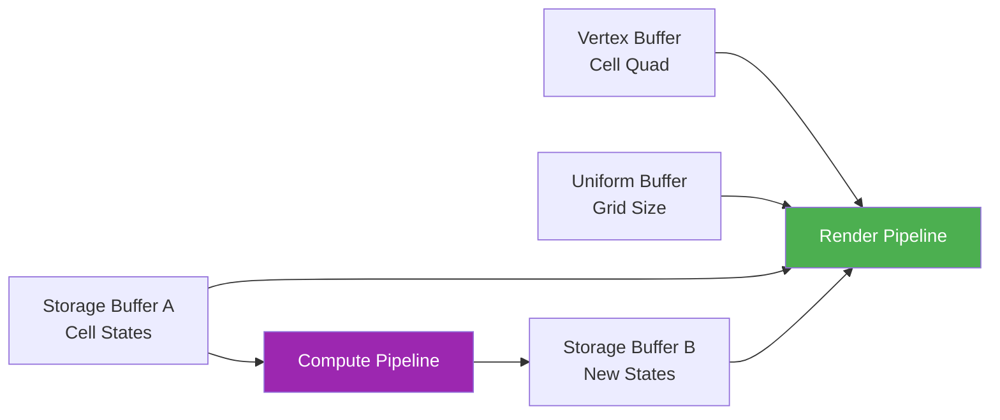

#### 5. Buffer Architecture (Ping-Pong)

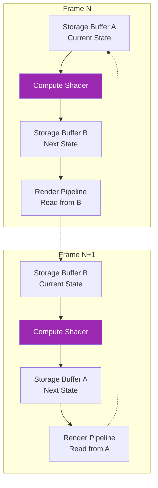

**Key insight:** 
- Compute writes to buffer `(step + 1) % 2`
- Render reads from buffer `(step + 1) % 2` (the latest computed state)

#### 6. Simulation Timing

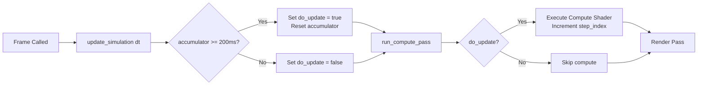

**Desktop timing:** `dt` calculated using `SDL.GetPerformanceCounter()`  
**Web timing:** `dt` provided by browser (seconds since last frame)

#### 7. Frame Rendering

```odin
frame :: proc "c" (dt: f32) {
    update_simulation(dt)
    
    // Acquire surface texture
    // Create command encoder
    
    run_compute_pass(encoder)  // Conditional based on timing
    
    // Render pass
    // - Clear to dark blue
    // - Bind render pipeline
    // - Bind group: (step + 1) % 2  (read latest)
    // - Draw instances: GRID_SIZE * GRID_SIZE
    
    // Submit and present
    
    if did_compute {
        step_index += 1
    }
}
```

---

## os_desktop.odin - SDL3 Platform Layer

Provides synchronous initialization and blocking event loop for desktop platforms.

### Key Components

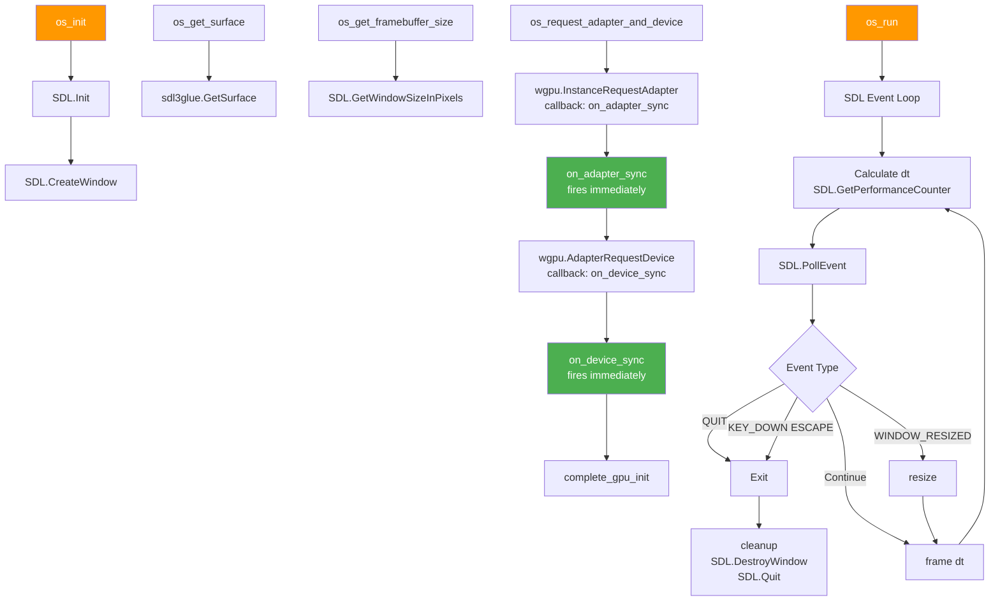

### Synchronous Callbacks

On desktop, WebGPU callbacks fire **immediately** (synchronously):

```odin
wgpu.InstanceRequestAdapter(...)
// Callback fires before this line executes
// adapter is already available
```

### Event Loop

```odin
os_run :: proc() {
    last := SDL.GetPerformanceCounter()
    
    for running {
        now = SDL.GetPerformanceCounter()
        dt = f32((now - last) * 1000) / f32(SDL.GetPerformanceFrequency())
        last = now
        
        for SDL.PollEvent(&event) {
            #partial switch event.type {
            case .QUIT: running = false
            case .KEY_DOWN:
                if event.key.scancode == .ESCAPE {
                    running = false
                }
            case .WINDOW_RESIZED: resize()
            }
        }
        
        frame(dt)  // dt in milliseconds
    }
}
```

---

## os_web.odin - WASM Platform Layer

Provides asynchronous initialization and browser-driven event loop for web platforms.

### Key Components

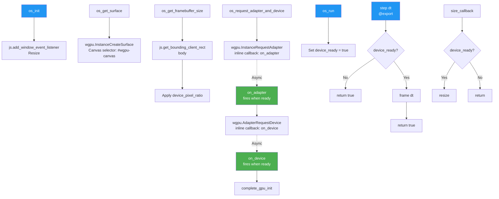

### Asynchronous Callbacks

On web, WebGPU callbacks fire **asynchronously** (when browser completes operation):

```odin
wgpu.InstanceRequestAdapter(...)
// Function returns immediately
// Callback fires later (100-500ms typical)
```

**Critical:** Callbacks must be defined **inline** in the same scope for WASM:

```odin
os_request_adapter_and_device :: proc() {
    wgpu.InstanceRequestAdapter(
        state.instance,
        &{compatibleSurface = state.surface},
        {callback = on_adapter},
    )
    
    // Define callback inline
    on_adapter :: proc "c" (...) {
        context = state.ctx
        // ... adapter handling
        wgpu.AdapterRequestDevice(..., {callback = on_device})
        
        // Nested inline callback
        on_device :: proc "c" (...) {
            context = state.ctx
            // ... device handling
            complete_gpu_init(device)
        }
    }
}
```

### Browser Integration

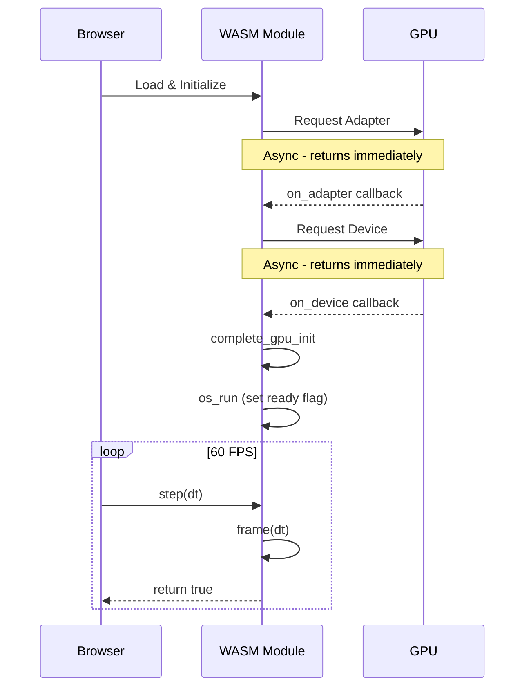

### Exported Functions

```odin
@(export)
step :: proc(dt: f32) -> bool {
    context = state.ctx
    
    if !device_ready {
        return true  // Still initializing
    }
    
    frame(dt)  // dt in seconds
    return true
}

@(fini)
cleanup_on_exit :: proc "contextless" () {
    cleanup()
    js.remove_window_event_listener(.Resize, nil, size_callback)
}
```

---

## Shader Architecture

### compute.wgsl - Game of Life Rules

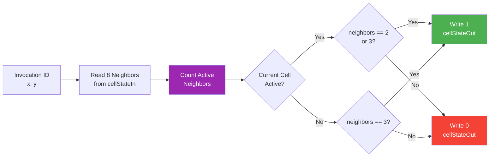

**Workgroup Configuration:**
- Size: 8×8 (64 threads per workgroup)
- Dispatch: 4×4 workgroups for 32×32 grid
- Total: 1,024 parallel executions

**Bindings:**
- `@binding(0)`: Uniform buffer (grid size)
- `@binding(1)`: Read-only storage (current cell states)
- `@binding(2)`: Storage (output cell states)

### render.wgsl - Cell Visualization

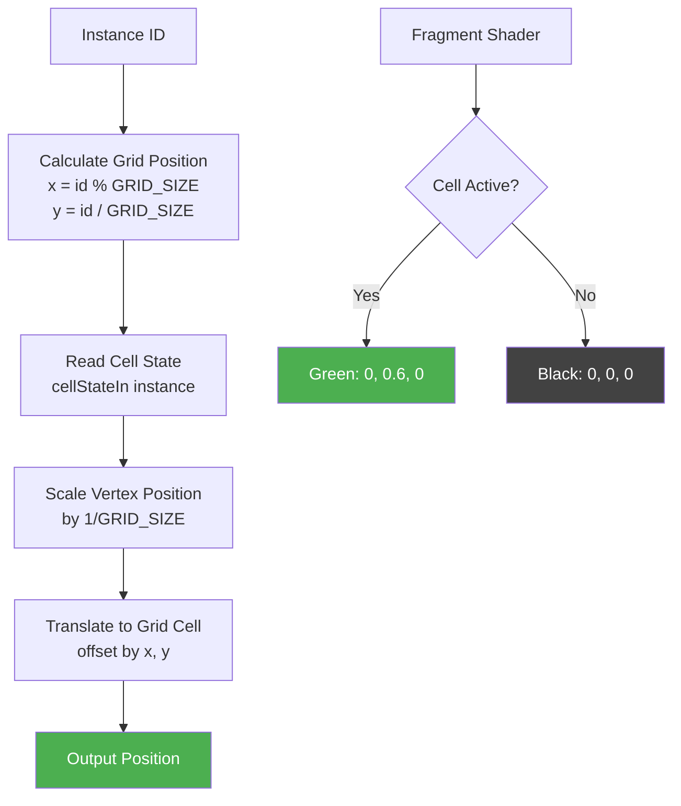

**Vertex Shader:**
- Input: Cell quad vertices (-0.8 to 0.8)
- Instance rendering: Draw GRID_SIZE² instances
- Each instance represents one cell

**Fragment Shader:**
- Simple color selection based on cell state
- Active cells: Green `(0, 0.6, 0)`
- Inactive cells: Black `(0, 0, 0)`

---

## Platform Differences

### Desktop (SDL3)

| Aspect | Implementation |
|--------|----------------|
| **Windowing** | SDL3 native window |
| **Event Loop** | Blocking `SDL.PollEvent()` |
| **Frame Timing** | Manual via `SDL.GetPerformanceCounter()` |
| **WebGPU Init** | Synchronous callbacks |
| **Delta Time** | Milliseconds (calculated) |
| **Exit Handling** | Window close or Escape key |

### Web (WASM)

| Aspect | Implementation |
|--------|----------------|
| **Windowing** | HTML5 Canvas (`#wgpu-canvas`) |
| **Event Loop** | Browser `requestAnimationFrame` calls `step()` |
| **Frame Timing** | Provided by browser |
| **WebGPU Init** | Asynchronous callbacks (inline) |
| **Delta Time** | Seconds (from browser) |
| **Exit Handling** | Browser tab close |

### Callback Timing Diagram

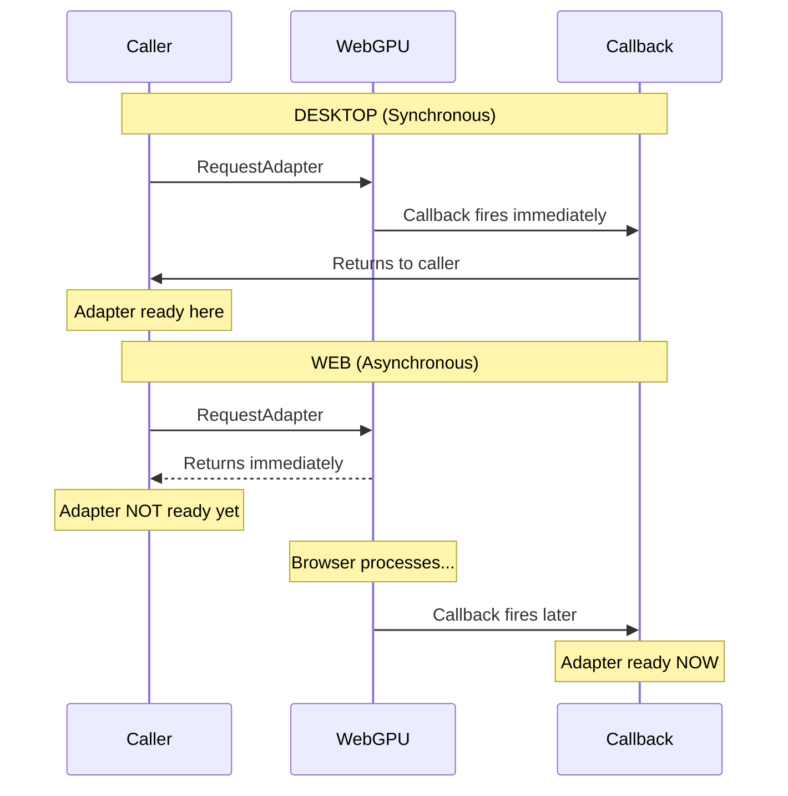

---

## Build System

### Desktop Build

```bash
odin build . -out:game-of-life -vet -strict-style -vet-tabs -disallow-do -warnings-as-errors
./sdl3-Game-of-life
```

**What happens:**
1. Compiler includes `main.odin` and `os_desktop.odin`
2. `os_web.odin` excluded via `#+build js` tag
3. Links SDL3 and WebGPU native libraries
4. Creates native executable

### Web Build

```bash
odin build . -target:js_wasm32 -out:web/game_of_life.wasm
```

**What happens:**
1. Compiler includes `main.odin` and `os_web.odin`
2. `os_desktop.odin` excluded via `#+build !js` tag
3. Generates WebAssembly module
4. Exports `step()` function for browser

### Build Tags Explanation

```odin
// os_desktop.odin
#+build !js        // Include when NOT building for JavaScript
package main

// os_web.odin
#+build js         // Include ONLY when building for JavaScript
package main
```

Build tags are **file-level** in Odin - you cannot use them inline within functions.

---

## Data Flow

### Initialization Flow

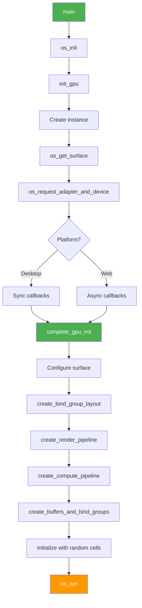

### Frame Flow

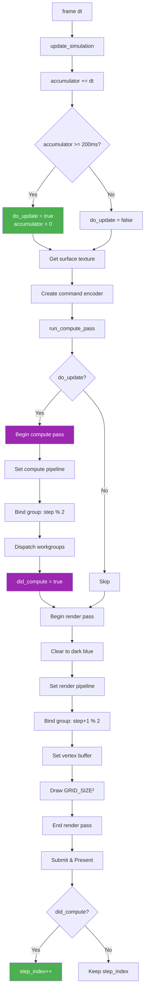

---

## Performance Characteristics

### GPU Workload

| Operation | Frequency | GPU Load |
|-----------|-----------|----------|
| **Compute Shader** | 5 Hz | 1,024 threads (32×32 grid) |
| **Render Pass** | 60 FPS | 1,024 instances, 6 vertices each |
| **Buffer Updates** | 0 Hz | No CPU→GPU transfers after init |

### Memory Usage

| Resource | Size | Count | Total |
|----------|------|-------|-------|
| **Vertex Buffer** | 48 bytes | 1 | 48 B |
| **Uniform Buffer** | 8 bytes | 1 | 8 B |
| **Storage Buffers** | 4 KB | 2 | 8 KB |
| **Bind Groups** | - | 2 | - |
| **Pipelines** | - | 2 | - |

**Total GPU memory:** ~8 KB (excluding shader bytecode and pipeline state)

### CPU Load

| Platform | Per Frame | Notes |
|----------|-----------|-------|
| **Desktop** | Minimal | Event polling, dt calculation |
| **Web** | Minimal | Browser calls `step()` |

**Key insight:** After initialization, all simulation logic runs on GPU. CPU only submits command buffers.

---

## Troubleshooting

### Desktop Issues

**Problem:** Window opens but cells don't update  
**Solution:** Check that delta time is being calculated (not passing `0`)

**Problem:** Window doesn't open  
**Solution:** Ensure SDL3 is installed and linked correctly

**Problem:** WebGPU errors  
**Solution:** Check that your GPU supports WebGPU (Metal on macOS, D3D12 on Windows, Vulkan on Linux)

### Web Issues

**Problem:** Black screen, no errors  
**Solution:** Check browser console - likely async callbacks not firing

**Problem:** "WebGPU not supported"  
**Solution:** Use Chrome/Edge with WebGPU enabled, serve over `http://127.0.0.1` (not `file://` or IPV6 [::]: <port>)

**Problem:** Callbacks never fire  
**Solution:** Ensure callbacks are defined **inline** in the same scope as registration

**Problem:** Canvas size wrong  
**Solution:** Check `device_pixel_ratio` and canvas CSS

### Common Issues

**Problem:** Compilation errors with build tags  
**Solution:** Build tags must be at top of file, before `package` declaration

**Problem:** Linking errors  
**Solution:** Ensure `vendor:wgpu`, `vendor:sdl3` are available in your Odin installation

---

## Future Enhancements

Potential improvements while maintaining simplicity:

1. **Interactive Controls**
   - Mouse click to toggle cells
   - Space bar to pause/resume
   - R key to randomize grid (matchin the Win32 example)

2. **Adjustable Parameters**
   - Grid size selection (16×16, 32×32, 64×64)
   - Update rate slider
   - Color themes

3. **Patterns**
   - Load predefined patterns (glider, blinker, etc.)
   - Save/load grid states

4. **Performance**
   - Larger grids (128×128, 256×256)
   - Multiple compute passes per frame
   - Benchmarking mode

**Constraint:** Keep 3-file structure, avoid over-abstraction

---

## References

- **Original Tutorial:** https://codelabs.developers.google.com/your-first-webgpu-app
- **Odin Language:** https://odin-lang.org
- **Odin WGPU Bindings:** https://pkg.odin-lang.org/vendor/wgpu/
- **SDL3:** https://wiki.libsdl.org/SDL3/
- **WebGPU Spec:** https://gpuweb.github.io/gpuweb/
- **Conway's Game of Life:** https://en.wikipedia.org/wiki/Conway%27s_Game_of_Life

---

## License

This code is part of the Odin examples repository.

---

*Last updated: October 13, 2025*  

